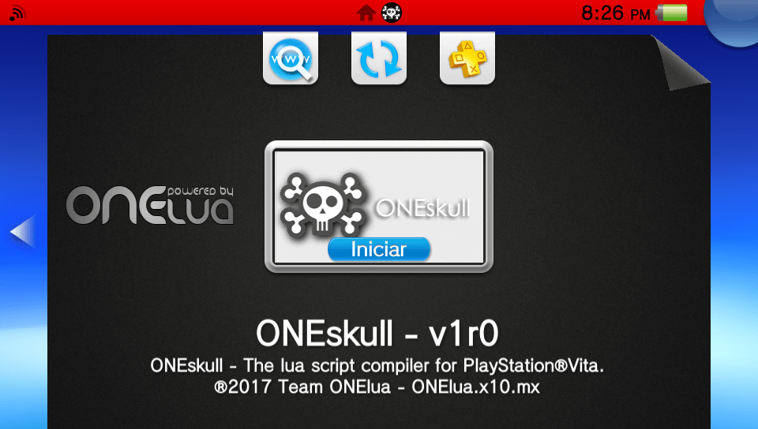
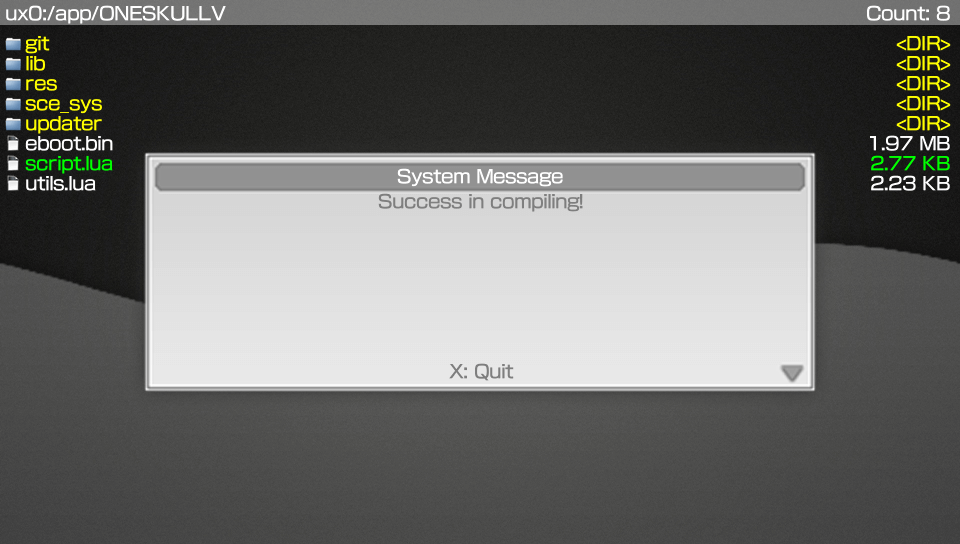

# ONEskull  

Simple and versatile lua script compiler.

### Description ###
This useful application will allow you to compile lua script´s, to load faster in your apps.

### Controls ###
- [up]/[down]: Browse the list of files.
- [cross]: Folder/Enter in directory selected - File/Compile file selected and create in same root a script compile with '.lue' extension.

### Changelog 1.0 ###
- Initial release.
- Added automatic network update. app will now notify you when there's a new update.
- Support navigate in ux0 files.
- Support script compilation one by one.

### TO-DO ###
- Add support for compiling complete projects.
- Add more GUI.
- Add more stuff.

### Note ###
- Remember to save your source code well, since a compiled script is not readable, therefore you can not change the code.

### Report bugs ###
if you see something wrong, please submit an issue or pull request.

### Credits ###
- The idea comes from my friend and coder, **Nekerafa**.

### Donation ###
In case you want to support my work on the vita, you can always donate for some coffee. Any amount is highly appreciated:

